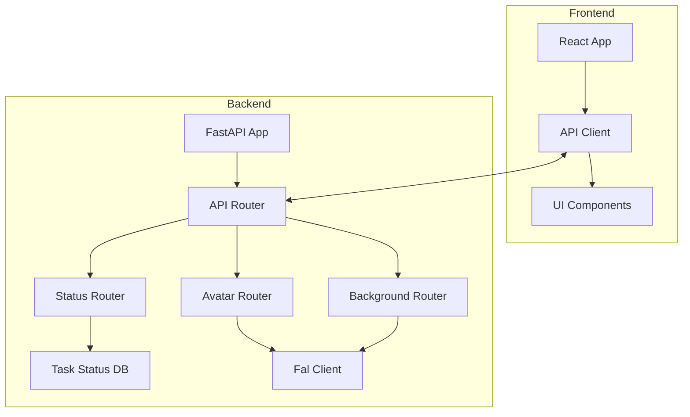

# System Patterns

## Architecture Overview
The system follows a client-server architecture pattern with the following components:

### Backend
- FastAPI application server
- Router-based endpoint organization
- In-memory task status storage
- External service integration (fal-client)

### Frontend
- React Single Page Application
- Component-based architecture
- Material-UI component library
- Axios-based API client

## Design Patterns

### Backend Patterns
1. **Router Pattern**
   - Modular endpoint organization
   - Separate routers for different functionalities
   - Global API prefix for versioning

2. **Status Management Pattern**
   - In-memory task status tracking
   - Centralized status storage
   - Status update mechanism

3. **CORS Middleware Pattern**
   - Global CORS configuration
   - Flexible origin handling
   - Standard HTTP method support

### Frontend Patterns
1. **Component Pattern**
   - Reusable UI components
   - Container/Presenter pattern
   - Material-UI integration

2. **API Client Pattern**
   - Centralized API configuration
   - Request/response interceptors
   - Error handling middleware

3. **State Management Pattern**
   - React hooks for local state
   - Context API for global state
   - Loading state management

## Component Relationships

## API Interaction Patterns
1. **Request Flow**
   - Frontend initiates request
   - Axios intercepts and adds headers
   - Backend processes request
   - Response returns to frontend
   - Interceptors handle errors

2. **Status Management**
   - Task creation returns task ID
   - Polling mechanism for status updates
   - Error handling at each step
   - Loading states for UI feedback

3. **Error Handling**
   - HTTP status code mapping
   - Error message formatting
   - User-friendly error display
   - Retry mechanisms

## Key Technical Decisions
1. Use of FastAPI for modern, async-capable API development
2. In-memory storage for task status (simplicity over persistence)
3. Modular router structure for maintainability
4. CORS middleware for frontend integration
5. External service integration via fal-client
6. React with Material-UI for frontend development
7. Axios for API communication
8. Component-based architecture for UI development 