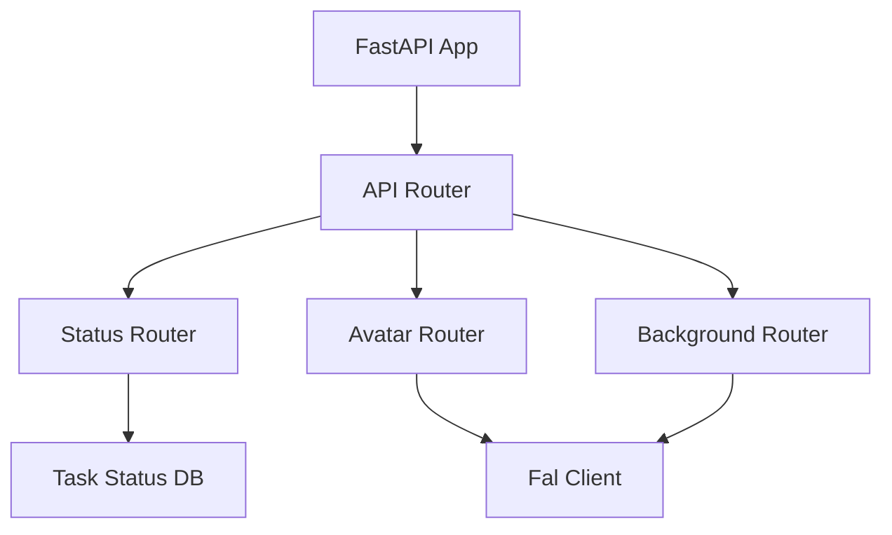

# System Patterns

## Architecture Overview
The system follows a microservice architecture pattern with the following components:
- FastAPI application server
- Router-based endpoint organization
- In-memory task status storage
- External service integration (fal-client)

## Design Patterns
1. **Router Pattern**
   - Modular endpoint organization
   - Separate routers for different functionalities
   - Global API prefix for versioning

2. **Status Management Pattern**
   - In-memory task status tracking
   - Centralized status storage
   - Status update mechanism

3. **CORS Middleware Pattern**
   - Global CORS configuration
   - Flexible origin handling
   - Standard HTTP method support

## Component Relationships

## Key Technical Decisions
1. Use of FastAPI for modern, async-capable API development
2. In-memory storage for task status (simplicity over persistence)
3. Modular router structure for maintainability
4. CORS middleware for frontend integration
5. External service integration via fal-client 